OrangeForRN2483 library
======
[]()

Arduino library for LoRa® communication with the Microchip RN2483 LoRaWAN module.


# Introducing : ExpLoRer
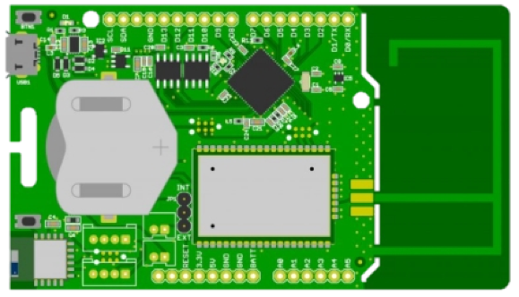

## Why Arduino ?
* Open Source
* Industry standard
* Easily accessible
	* Free IDEs
	* No flashing tools needed – only a USB cable
	* Simple structure (setup & loop) with examples
* Excellent HAL
	* Re-use projects across AVR, PIC, Cortex cores
* Hugely popular!

## Explorer - Arduino
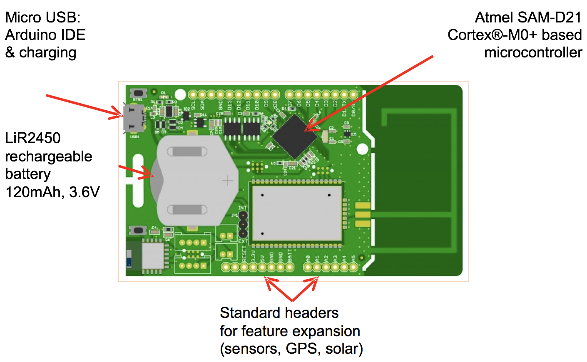
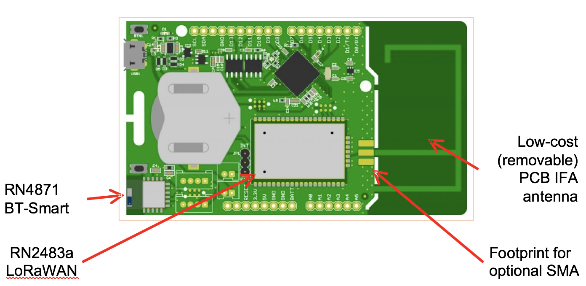
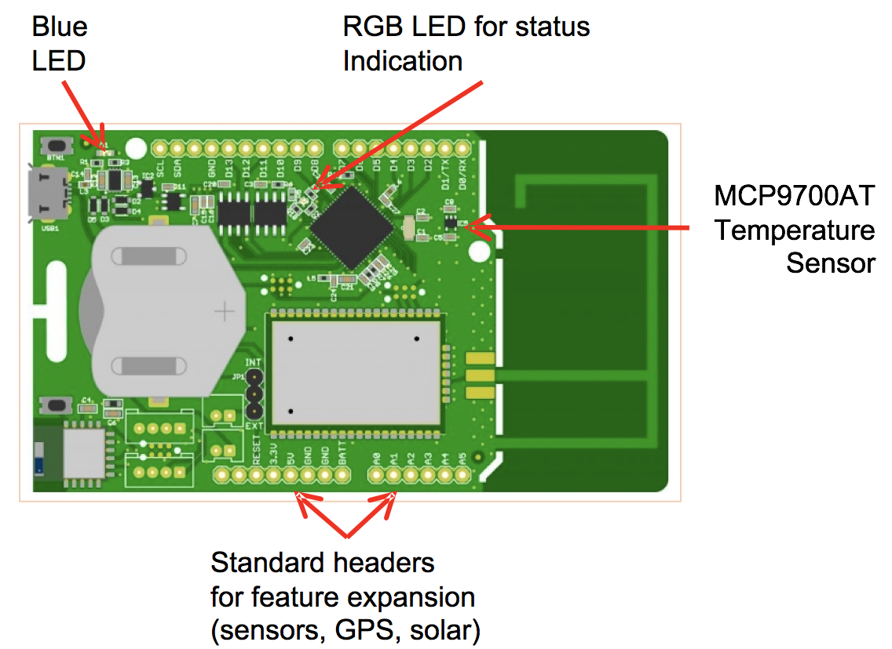
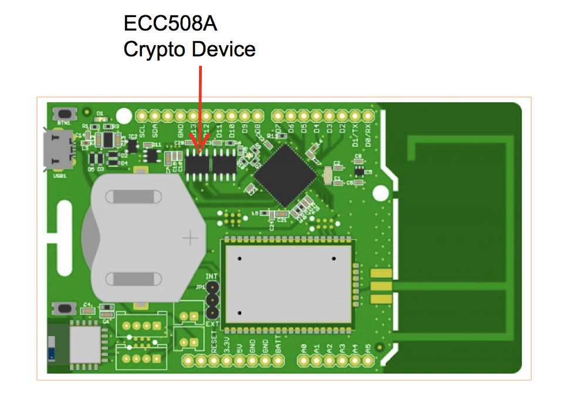


## Specifications
| Microcontroller        | ATSAMD21G18, 32-Bit ARM Cortex M0+                  |
|------------------------|-----------------------------------------------------|
| Compatibility          | Arduino M0 Compatible                               |
| Size                   | 40 x 25 mm                                          |
| Operating Voltage      | 3.3V                                                |
| I/O Pins               | 20                                                  |
| Analog Output Pin      | 10-bit DAC                                          |
| External Interrupts    | Available on all pins                               |
| DC Current per I/O pin | 7 mA                                                |
| Flash Memory           | 256 KB and  4MB (external flash)                    |
| SRAM                   | 32KB                                                |
| EEPROM                 | Up to 16KB by emulation                             |
| Clock Speed            | 48 MHz                                              |
| Power                  | 5V USB power and/or 3.7 LiPo battery                |
| Charging               | Solar charge controller, up to 500mA charge current |
| LED                    | RGB LED, Blue LED                                   |
| LoRa                   | Microchip RN2483 Module                             |
| Bluetooth              | Microchip RN4871 Module                             |
| Cyptochip              | ATECC508A                                           |
| Temperature sensor     | MCP9700AT                                           |
| USB                    | MicroUSB Port

## Pinout
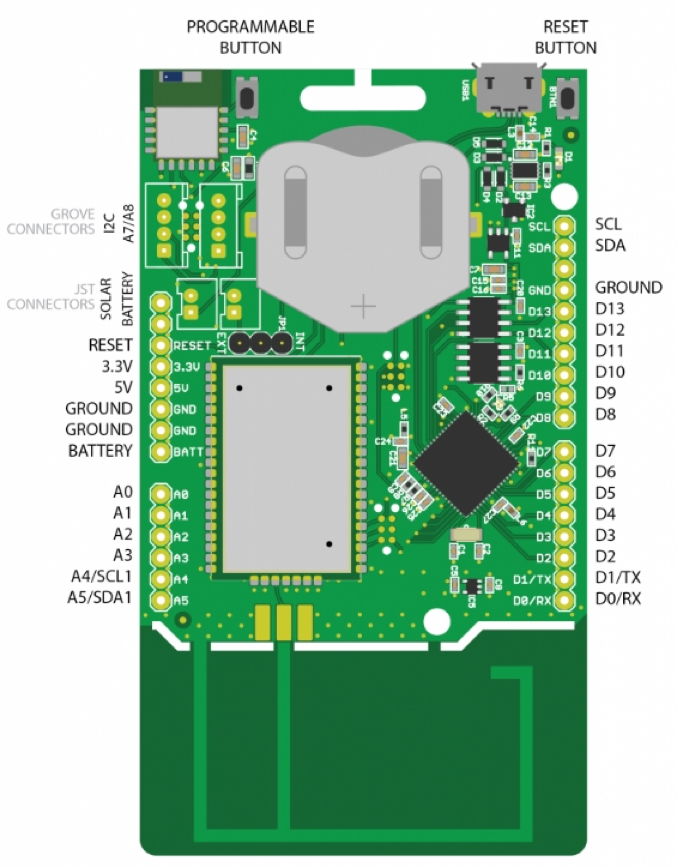

## Pins Definition

| **Pin description** | **Pin number** | **Definition** |
|---------------------|----------------|----------------|
| RGB Red LED         |                | LED_RED        |
| RGB Green LED       |                | LED_GREEN      |
| RGB Blue LED        |                | LED_BLUE       |
| Blue LED            | D13            | LED_BUILTIN    |
| Bluetooth Wake      |                | BLUETOOTH_WAKE |
| Bluetooth Reset     |                | BT_RESET       |
| Push Button         |                | BUTTON         |
| LoRa Reset          |                | LORA_RESET     |
| Temperature Sensor  | A6             | TEMP_SENSOR    |
| Grove Header		  | 14-15             | -    |
| Grove Header I2C    | 33-34             | PIN_WIRE_SDA, PIN_WIRE_SCL    |

## Grove connector
*	The Seeedstudio Grove system is a seamless set of open-source plug-and-play components. It simplifies the study and electronic prototypes by proposing a wide selection of sensors and actuators
*	You can find two types of grove connectors on the board:
	*	I2C
	*	Analogic
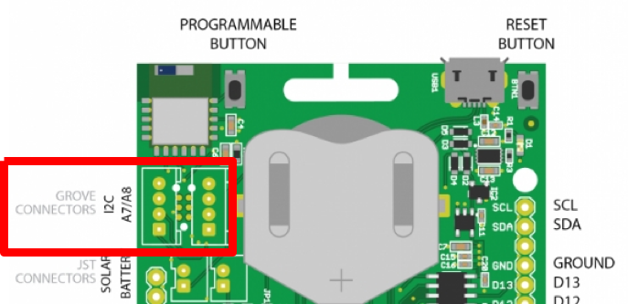

## Solar power
* You can plug on the board a solar panel This input has some limitations
	* Maximum voltage : 5.5V
	* Maximum current : 500mA
	* Maximum power : 2.5W

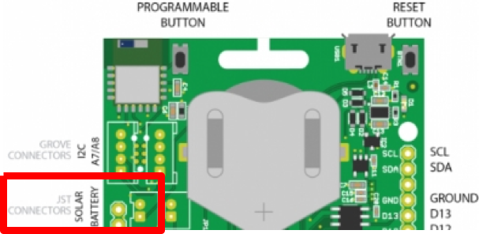
## ARDUINO IDE Setup
* Download and install the latest Arduino IDE: [https://www.arduino.cc/en/Main/Software]().

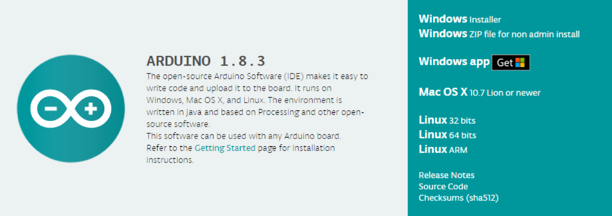

### Board Setup
* In order to install the board you will need to add the SODAQ board manager URL: `http://downloads.sodaq.net/package_sodaq_samd_index.json` to File -> Preferences -> Additional Board Manager URLs


* Then, the SODAQ SAMD Boards package will appear in the Tools -> Board -> Board Manager
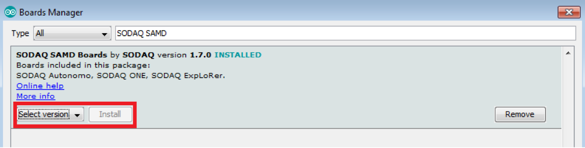
* Install the latest SODAQ SAMD Boards package
* Select the SODAQ ExpLoRer board from Tools -> Board
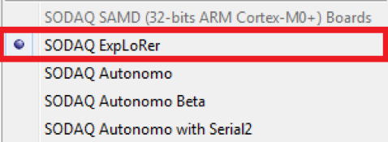
* Import the libraries provided by using: Sketch -> Include Library -> Add .ZIP Library

* Then you search for the file named ‘OrangeRn2483.zip’ that you have previously downloaded on
[https://github.com/Orange-OpenSource]()

## Arduino IDE Basis
* Open a sketch example file (.ino)
	* From menu : File -> Examples -> OrangeRn2483
* (1) Compile and check if the code has no error
* Press the reset button twice within a second to place the board into bootloader mode and is expecting a new sketch
* Select the ExpLoRer COM port assigned
* (2) Upload the sketch to the board
* (3) Open the Serial monitor for debugging

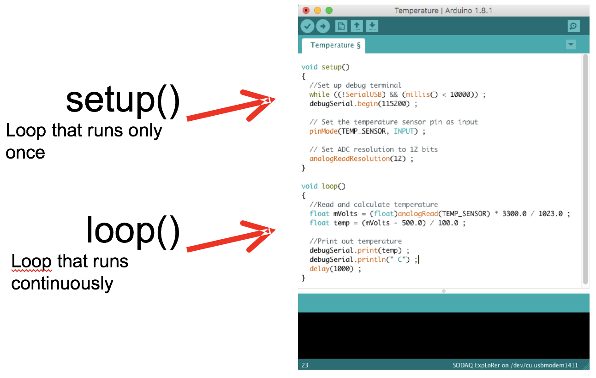

## Hardware Serials
* The ExpLoRer has 4 hardware serials:

	* SerialUSB this is for debugging over the USB cable
	* Serial Serial is attached to pin D1/TX and D0/RX
	* Serial1 is connected to the RN4871 Bluetooth module
	* Serial2 is connected to the RN2483 LoRaWAN module

	* Software Serial refer to https://www.arduino.cc/en/Reference/SoftwareSerial
* The sketch starts direct after uploading new code or when connected to a power source. After opening a Serial Monitor the code will not reset, add the following code to your sketch if you want your sketch to wait for a Serial Monitor

```c++
void setup() {
	// put your setup code here, to run once:
	// wait for SerialUSB or start after 10 seconds 	while ((!SerialUSB) && (millis() < 10000)) ;
	SerialUSB.begin(57600) ;
	Serial.begin(57600);
	Serial1.begin(115200);
	Serial2.begin(57600);
}

void loop() {
	// put your main code here, to run repeatedly:
}
```
## Basics Sketches
* The Arduino IDE has some examples built in
* Open the ExtractHardwareDevEUI sketch File -> Examples -> OrangeRn2483
-> ExtractHardwareDevEUI

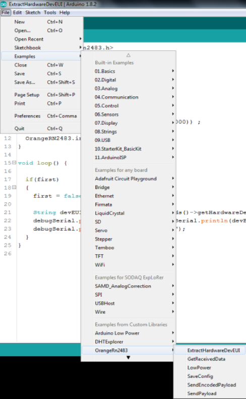

# Main Features of the kit
## Getting Started
### Reset button
* On legacy Arduino board the reset button restarts your program from the beginning
* On the ExpLoRer board the reset button has two modes:
	* Mode 1: simple click that acts as legacy Arduino reset
	* Mode 2: double click that starts the board in a bootloader mode. In this mode, Arduino sketch is put on hold and the board awaits the upload of a new sketch.
* Warning:
	* When switching between mode 1 and 2 the COM port that you see in Arduino IDE will change (but remains the same for a given mode)

```c++
void setup() {
	// Configure the button as an input
	// and enable the internal pull-up resistor
	pinMode(BUTTON, INPUT_PULLUP);
	pinMode(LED_BUILTIN, OUTPUT);
}
void loop() {
	// Read the button value into a variable int sensorVal = digitalRead(BUTTON) ;
	// Turn on the LED when the Button is pushed
	if 	(sensorVal == HIGH){
		digitalWrite(LED_BUILTIN, LOW) ;
	} else {
		digitalWrite(LED_BUILTIN, HIGH) ; }
}
```

### Push Button
* The ExpLoRer Starterkit has a programmable button
* This example will light the built-in Blue LED when the button is pushed

### RGB LED
```c++
int led = LED_RED;
// the PWM pin the LED int brightness = 0;
// how bright the LED int fadeAmount = 5;
// how many points to is attached to is fade the LED by

// the setup routine runs once when you press reset: void setup() {
	pinMode(led, OUTPUT) ;
}

	// the loop routine runs over and over again forever: void loop() {
	// set the brightness analogWrite(led, brightness) ;
	// change the brightness for next time through the loop: brightness = brightness + fadeAmount ;
	// reverse the direction of the fading at the ends of the fade:

if (brightness == 0 || brightness == 255) {
	fadeAmount = -fadeAmount ;
}

// wait for 30 milliseconds to see the dimming effect
delay(30);
}
```

### Temperature Sensor
```c++
#define debugSerial SerialUSB
void setup() {
	pinMode(TEMP_SENSOR, INPUT);
	// Set ADC resolution to 12 bits
	analogReadResolution(12);
}

void loop() {
	// 10mV per C, 0C is 500mV
	float mVolts = (float)analogRead(TEMP_SENSOR) * 3300.0 / 4096.0;
	float temp = (mVolts - 500.0) / 10.0;
	debugSerial.print(temp) ; debugSerial.println(" C") ;
	delay(1000);
	}
```
### Battery Charging
* USB power and Solar panel sources can be used for charging
* Jumpers JP1 determines which battery is used/charged
* (1) External battery
* (2) Internal battery

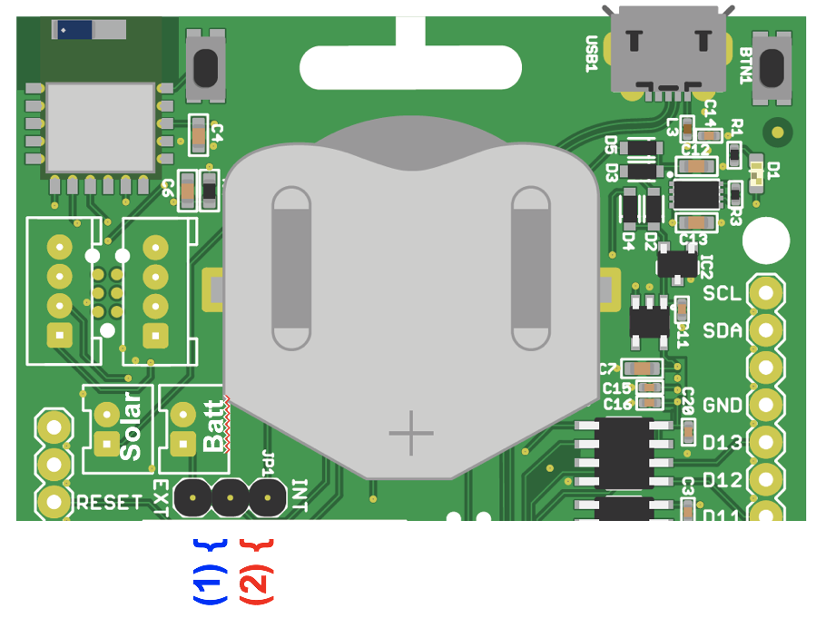

### BLE Module
Arduino library for using the Microchip RN487x BLE module

```c++
#include "RN487x_BLE.h"
#define bleSerial Serial1
void setup(){
	rn487xBle.hwInit();
	bleSerial.begin(rn487xBle.getDefaultBaudRate()); 	rn487xBle.initBleStream(&bleSerial);

	if (rn487xBle.swInit()) {
		rn487xBle.enterCommandMode();
		rn487xBle.stopAdvertising();
		rn487xBle.setAdvPower(3);
		rn487xBle.setSerializedName("Microchip"); 		rn487xBle.clearAllServices();
		rn487xBle.reboot();
	}
}
void loop() {
}
```

### LoRa® Communication

#### Requirements
* IDE Arduino
* Microchip RN2483 LoRaWAN module


#### Installation

Download the latest version of the library (zip file) https://github.com/INSERT_URL.

Or clone from GitHub:

```
$ git clone https://github.com/Orange-OpenSource/INSERT_REP_NAME.git
```

In Arduino IDE, go to Sketch **>** Import library **>** Add library and select the downloaded zip file.

In Sketch **>** Import library, you got now **OrangeForRN2483** library.


#### How to use ?

See Samples sketch : Files **>** examples

Different use cases are available depending on your needs.
```c++
#include <OrangeForRN2483.h>
// The following keys are for structure purpose only. You must define YOUR OWN.
const int8_t appEUI[8] = { 0x00, 0x00, 0x00, 0x00, 0x00, 0x00, 0x00, 0x00 };
const int8_t appKey[16] = { 0x00, 0x00, 0x00, 0x00, 0x00, 0x00, 0x00, 0x00, 0x00, 0x00, 0x00, 0x00, 0x00, 0x00, 0x00, 0x00 };

bool joinNetwork() {
	OrangeForRN2483.setDataRate(DATA_RATE_1); // Set DataRate to SF11/125Khz
	return OrangeForRN2483.joinNetwork(appEUI, appKey);
}

bool SendLoRaMessage() {
	const uint8_t size = 5;
	int8_t port = 5;
	int8_t data[size] = { 0x48, 0x65, 0x6C, 0x6C, 0x6F }; //Hello
	return OrangeForRN2483.sendMessage(data, size, port); //send unconfirmed message

}
```
* You can find a complete document on this library and its functions in the library’s file

# Orange Live Objects
## Getting Started
* Provision your LoRa end device to join the network
	* The devEUI is provided by the ExpLoRer board
Get and note the hardware devEUI of the board by using the ExtractHardwareDevEUI sketch


	* The application identifier (appEUI) is 8 bytes long (16 hexadecimal characters).
		* You can use this one 4578704C6F526572
		* Or create your own

	* The application session key (appKey) is specific for the end-device. It is 16 bytes long (32 hexadecimal characters).
		* It is safer to create your own appKey
		* Or you can create one using {FFEEDDCCBBAA9988} as the 8 first bytes and the device’s devEUI for the 8 last bytes. This option presents a security risk.

	* Write down your keys here for safe keeping :
		* devEUI =
		* appEUI =
		* appKEY =

* Go to the following URL to access Live Objects : [https://lpwa.liveobjects.orange-business.com/#/login]()

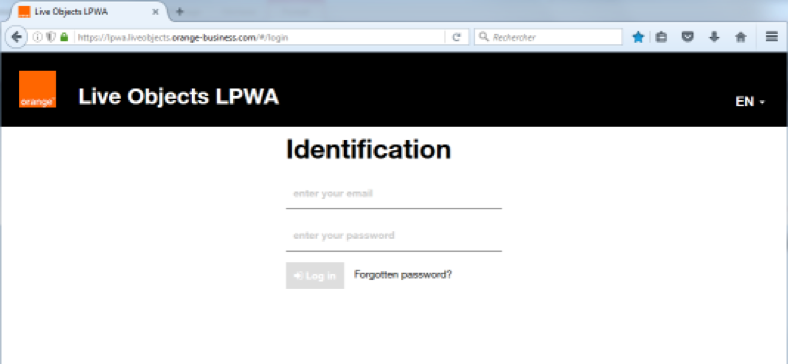
* You can find some useful videos about Live Objects on this website : [https://www.youtube.com/channel/UCqiOhIRIpjRvR3Bw0hMLciw]()

### Provisionning a device
* Create your device within Orange Live Objects by adding the activation keys and the right profile

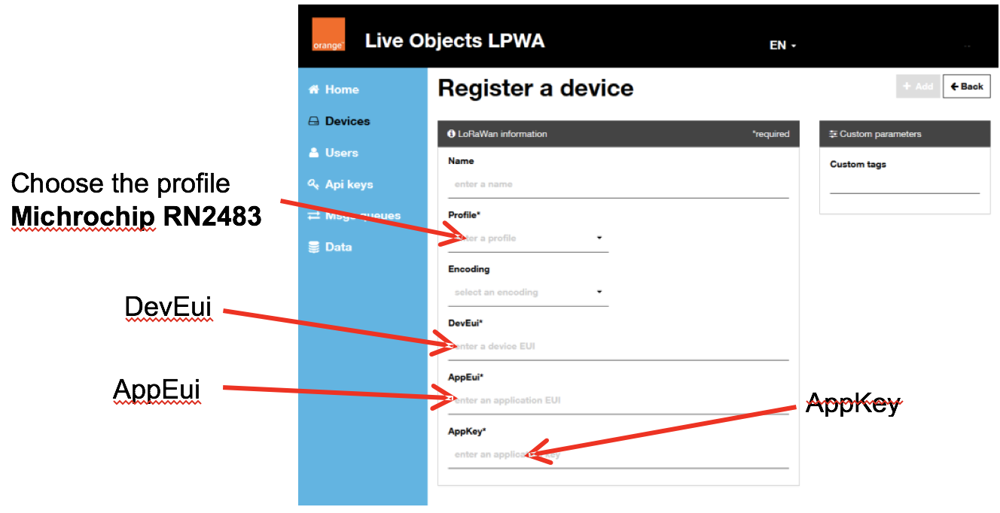

* In addition to the activation keys you have to choose the profil Microchip RN2483

* You device is now registered

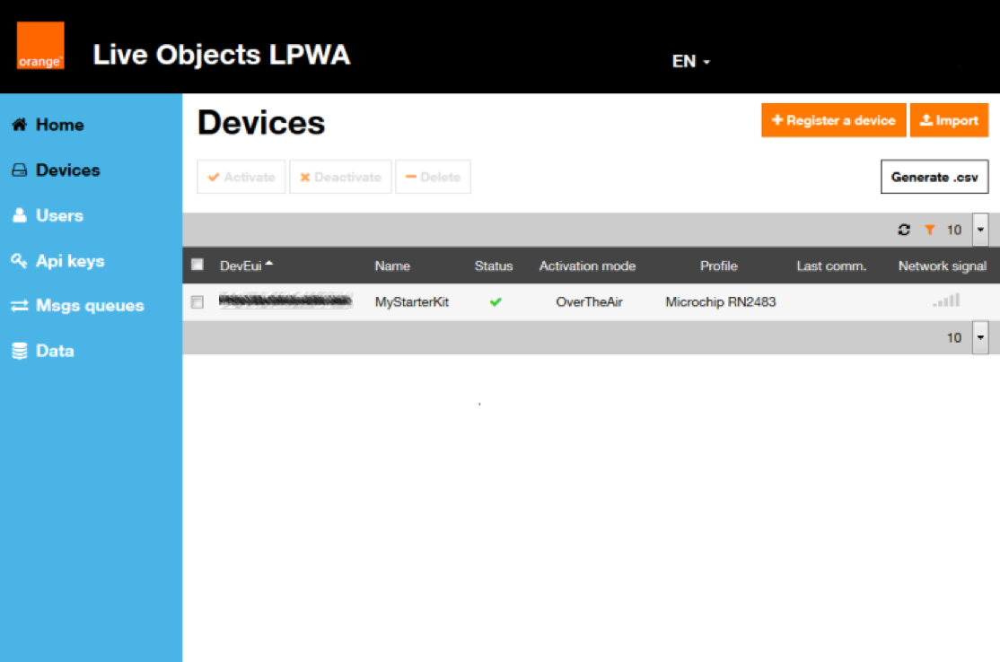

### Testing the network
* Open the SendPayload sketch to test your device * File -> Examples -> OrangeRn2483 -> SendPayload
* This sketch will send 3 payloads
* Modify the file with your own keys in HEX format (0x)
*
```c++
// The following keys are for structure purpose only. You must define YOUR OWN.
const int8_t appEUI[8] = { 0x00, 0x00, 0x00, 0x00, 0x00, 0x00, 0x00, 0x00 };
const int8_t appKey[16] = { 0x00, 0x00, 0x00, 0x00, 0x00, 0x00, 0x00, 0x00, 0x00, 0x00, 0x00, 0x00, 0x00, 0x00, 0x00, 0x00 };
```
* Here is what your code should look like :
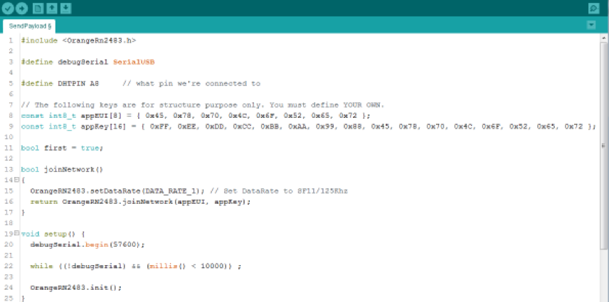

* (1) Upload the sketch to the board
* (2) Open the Serial monitor for debugging


You should see the following monitor :
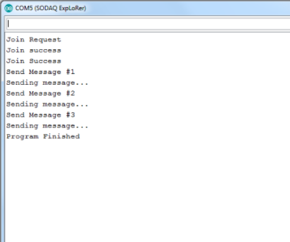

### Visualizing LoRa Messages
* To see the 3 payloads that have been sent :
	* On Live Object select your device
	

	* You are redirected to this page :
	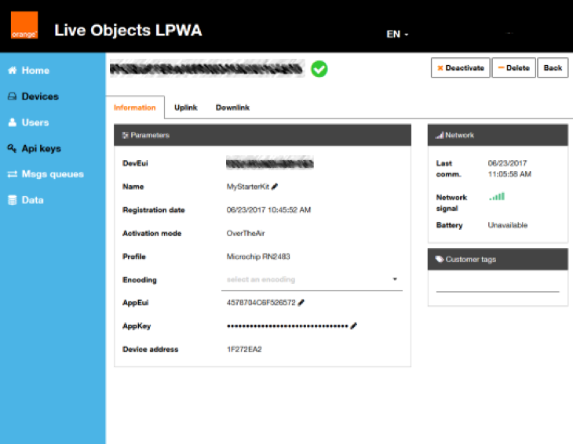

	* Cick on the uplink tab
	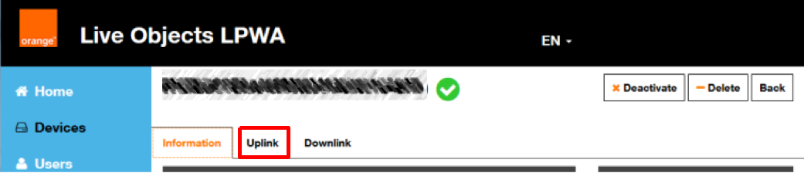

	* You can now see the 3 payloads you just sent
	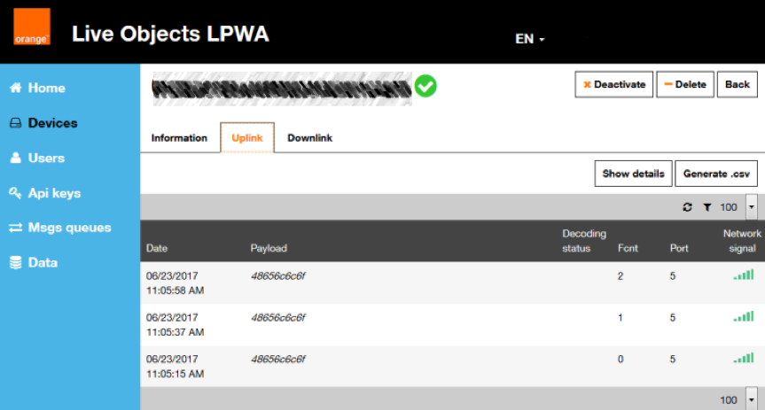

### Downlink
* Downlink is about sending payloads from Live Object to the device
	* Click on the downlink tab after selecting your device
	
	* Then you select the send button
	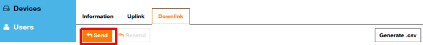
	* Then you fill in the port number and the data to send in hexadecimal form and click on send
	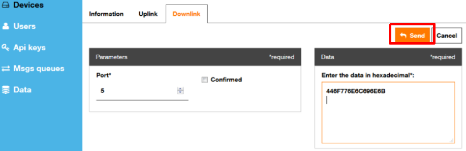

* To visualize your downlink use the GetReceivedData sketch
	* File -> Examples -> OrangeRn2483 -> GetReceivedData * Then send the payload from Live Object
* Finally open the Serial Monitor
	* You should see the data you sent

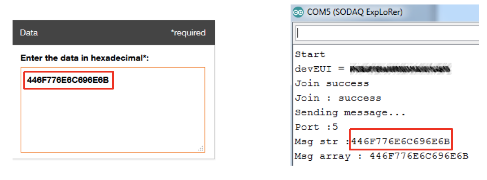


# License

This code is released under the Apache-2.0 license. See the `LICENSE.txt` file for more information.

Copyright (C) 2017 Orange

This software is distributed under the terms and conditions of the 'Apache-2.0' license which can be found in the file 'LICENSE.txt' in this package distribution or at 'http://www.apache.org/licenses/LICENSE-2.0'.
